# Architecture — diagrams & design notes

This document collects every architectural view of the **Multi-Agent University Query Orchestration System** in one place.  All diagrams are written in **Mermaid** with a consistent palette (black text on soft pastel fills) so they render the same way on GitHub, VS Code preview, or any Mermaid viewer.

> 🎨 **Style key** — every diagram uses the same theme initializer:
> ```text
> %%{init: {'theme':'base','themeVariables':{'fontFamily':'Inter, sans-serif','primaryTextColor':'#111111','lineColor':'#111111','primaryBorderColor':'#111111'}}}%%
> ```
> Fills (`classDef`): `#E8F1FF` (mobile / I-O), `#FFF4E0` (API / decisions), `#E8FFEF` (agents / LLMs), `#F5E8FF` (data stores), `#FFE8E8` (security).

---

## Table of contents

1. [Context diagram (Level-0)](#context-diagram-level-0)
2. [System architecture (Level-1)](#system-architecture-level-1)
3. [Component diagram — backend](#component-diagram--backend)
4. [Multi-agent orchestration graph](#multi-agent-orchestration-graph)
5. [Per-department agent sub-graph](#per-department-agent-sub-graph)
6. [Class diagram (backend ORM)](#class-diagram-backend-orm)
7. [ER diagram](#er-diagram)
8. [Use-case diagram](#use-case-diagram)
9. [Sequence — single-department direct answer](#sequence--single-department-direct-answer)
10. [Sequence — multi-department combined answer](#sequence--multi-department-combined-answer)
11. [Sequence — multi-department ticket creation](#sequence--multi-department-ticket-creation)
12. [Sequence — small talk](#sequence--small-talk)
13. [Ticket state machine](#ticket-state-machine)
14. [Data flow diagram](#data-flow-diagram)
15. [Deployment diagram](#deployment-diagram)
16. [Android navigation](#android-navigation)
17. [Authentication flow](#authentication-flow)
18. [Tool calling cycle (inside one dept agent)](#tool-calling-cycle-inside-one-dept-agent)

---

## Context diagram (Level-0)

The outermost view — who interacts with the system.

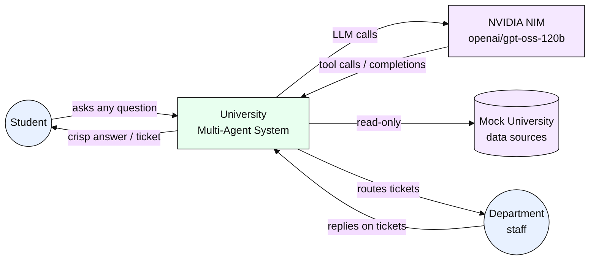

---

## System architecture (Level-1)

The full stack as it runs on a developer laptop.

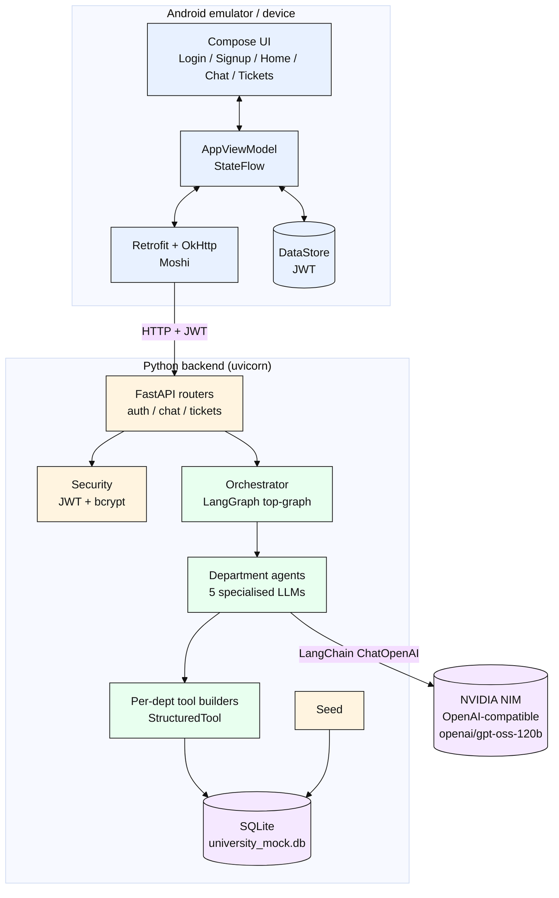

---

## Component diagram — backend

The modules inside `backend/app/` and how they depend on each other.

```mermaid
%%{init: {'theme':'base','themeVariables':{'fontFamily':'Inter, sans-serif','primaryTextColor':'#111111','lineColor':'#111111','primaryBorderColor':'#111111'}}}%%
flowchart LR
  subgraph entry["entry"]
    main[main.py]
    config[config.py]
  end

  subgraph api["api/"]
    auth[auth.py]
    chat[chat.py]
    tickets[tickets.py]
  end

  subgraph core["core"]
    sec[security.py]
    db[database.py]
    models[models.py]
    schemas[schemas.py]
    seed[seed.py]
  end

  subgraph agents["agents/"]
    orch[orchestrator.py]
    graph[graph.py]
    kb[knowledge_base.py]
    tools[tools.py]
    lctools[lc_tools.py]
    lcllm[lc_llm.py]
    llmc[llm_client.py]
  end

  main --> config
  main --> auth
  main --> chat
  main --> tickets
  main --> seed
  auth --> sec
  auth --> models
  auth --> schemas
  chat --> sec
  chat --> orch
  chat --> schemas
  tickets --> sec
  tickets --> models
  tickets --> schemas
  sec --> models
  sec --> db
  seed --> models
  seed --> db
  orch --> graph
  graph --> kb
  graph --> lctools
  graph --> lcllm
  graph --> models
  lctools --> tools
  tools --> models
  models --> db

  classDef entry fill:#FFF4E0,stroke:#111111,color:#111111
  classDef api fill:#FFF4E0,stroke:#111111,color:#111111
  classDef core fill:#F5E8FF,stroke:#111111,color:#111111
  classDef agents fill:#E8FFEF,stroke:#111111,color:#111111
  class main,config entry
  class auth,chat,tickets api
  class sec,db,models,schemas,seed core
  class orch,graph,kb,tools,lctools,lcllm,llmc agents
```

---

## Multi-agent orchestration graph

The top-level **LangGraph** `StateGraph`. Every node is either a deterministic Python step or an LLM call with its own prompt. The edges show the actual transitions in `backend/app/agents/graph.py`.

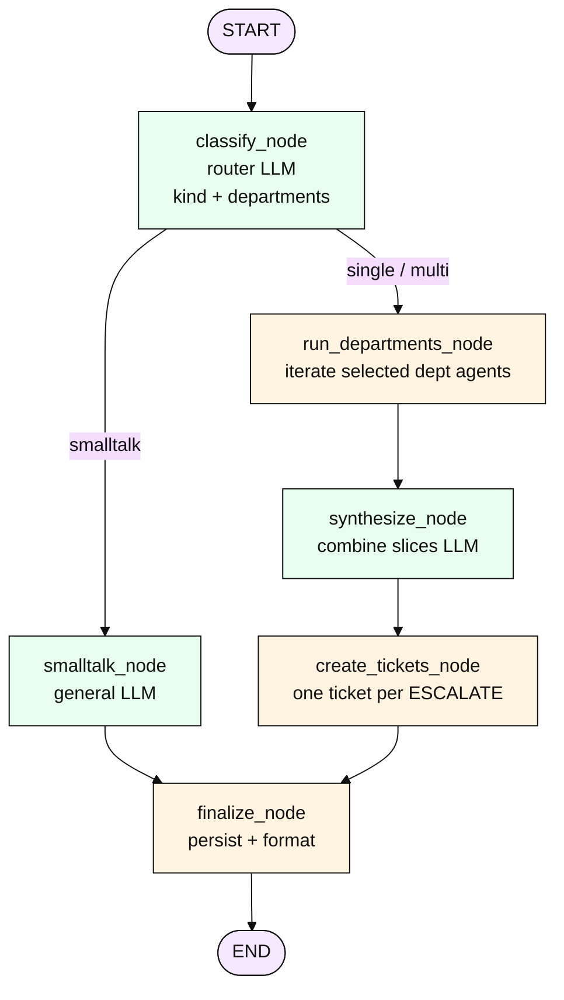

**Routing rules** (in `_parse_routing` + deterministic hints in `graph.py`):

```mermaid
%%{init: {'theme':'base','themeVariables':{'fontFamily':'Inter, sans-serif','primaryTextColor':'#111111','lineColor':'#111111','primaryBorderColor':'#111111'}}}%%
flowchart TD
  Q[student question] --> H1{contains<br/>greeting / thanks /<br/>goodbye / "what can you do"?}
  H1 -- yes --> SM[smalltalk]
  H1 -- no --> H2{contains<br/>defer / withdraw?}
  H2 -- yes --> MM1[multi:<br/>REGISTRAR + FINANCIAL + HOUSING]
  H2 -- no --> H3{contains transfer?}
  H3 -- yes --> MM2[multi:<br/>REGISTRAR + FINANCIAL + ADVISING]
  H3 -- no --> H4{contains<br/>change major / declare minor?}
  H4 -- yes --> MM3[multi:<br/>ADVISING + REGISTRAR]
  H4 -- no --> LLM[LLM classifier<br/>picks single or multi]

  classDef cond fill:#FFF4E0,stroke:#111111,color:#111111
  classDef out fill:#E8FFEF,stroke:#111111,color:#111111
  classDef io fill:#E8F1FF,stroke:#111111,color:#111111
  class H1,H2,H3,H4 cond
  class SM,MM1,MM2,MM3,LLM out
  class Q io
```

---

## Per-department agent sub-graph

Each department agent is itself a compiled `StateGraph` built fresh per request (because tools close over the request-scoped DB session + student id). It's the classic React-style **agent loop**.

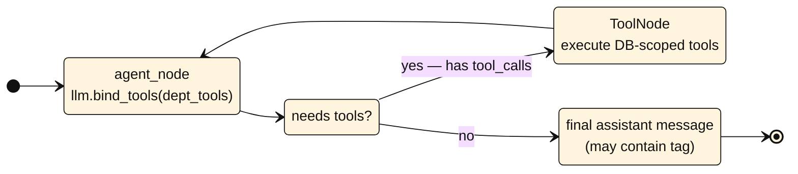

The agent's system prompt is **assembled per department** from three pieces:

```mermaid
%%{init: {'theme':'base','themeVariables':{'fontFamily':'Inter, sans-serif','primaryTextColor':'#111111','lineColor':'#111111','primaryBorderColor':'#111111'}}}%%
flowchart LR
  A[Identity & rules<br/>e.g. "You are the IT Help Desk agent..."]
  B[Department knowledge base<br/>knowledge_base.py KB_BY_CODE]
  C[Student context<br/>name / id / major / year / GPA]
  P[System prompt sent to LLM]
  A --> P
  B --> P
  C --> P

  classDef p fill:#E8FFEF,stroke:#111111,color:#111111
  class A,B,C,P p
```

---

## Class diagram (backend ORM)

The SQLAlchemy models in `backend/app/models.py` — what's stored, what's related.

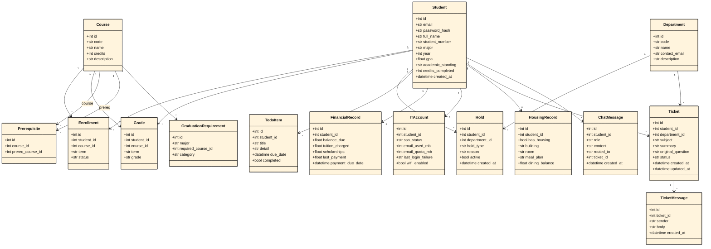

---

## ER diagram

Same domain, drawn as ER.

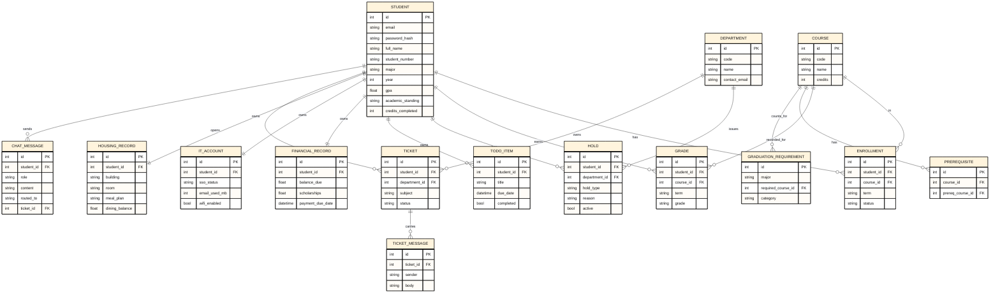

---

## Use-case diagram

The actor / use-case view — what the student (and, indirectly, staff) can do.

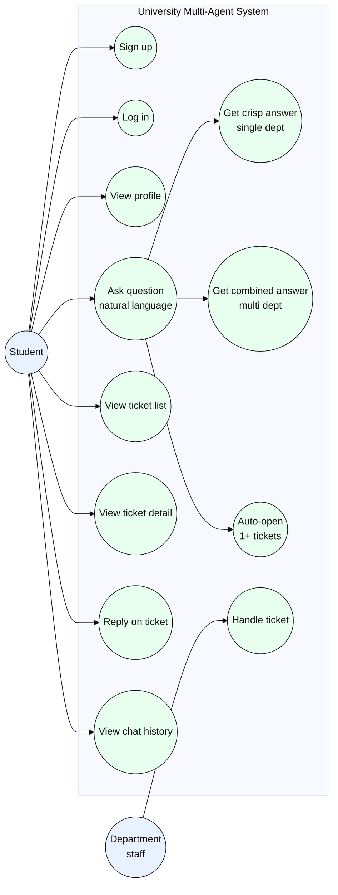

---

## Sequence — single-department direct answer

_"What classes am I in this semester?"_  → REGISTRAR handles it via one tool call, no ticket.

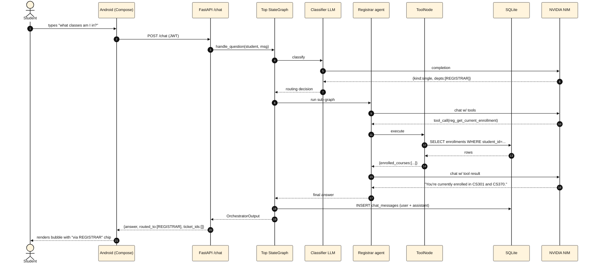

---

## Sequence — multi-department combined answer

_"If I drop MATH152 how does that affect my degree progress and my financial aid?"_  → ADVISING + FINANCIAL, no tickets.

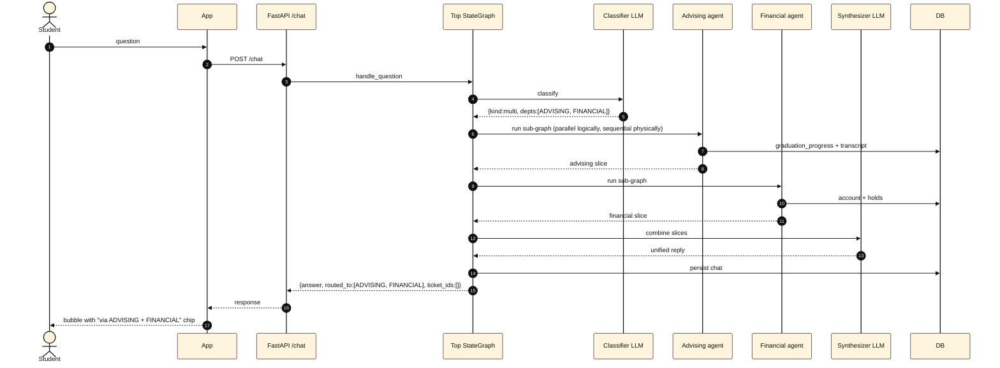

---

## Sequence — multi-department ticket creation

_"I need to defer for a semester"_  → REGISTRAR + FINANCIAL + HOUSING each open their own ticket.

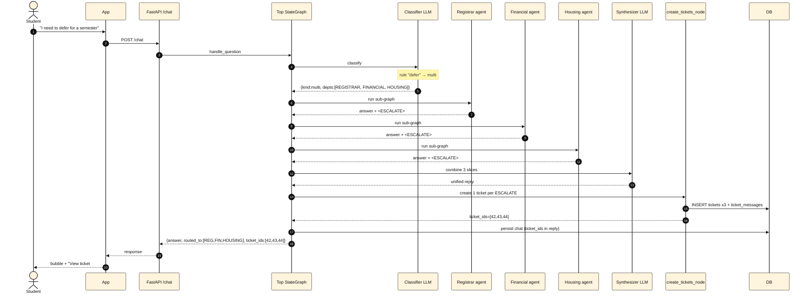

---

## Sequence — small talk

_"Thanks!"_ — never touches a department or the DB.

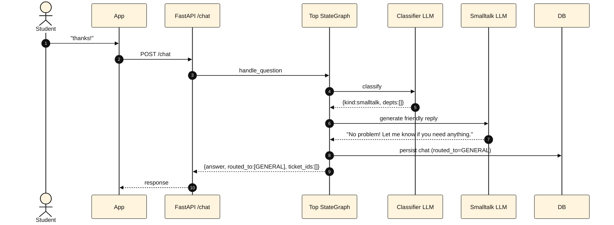

---

## Ticket state machine

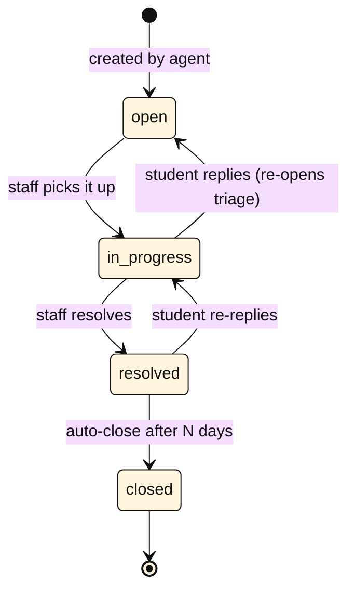

---

## Data flow diagram

Where every kind of data physically lives and how it moves.

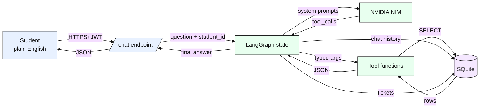

---

## Deployment diagram

Everything is local. Two processes, one external service.

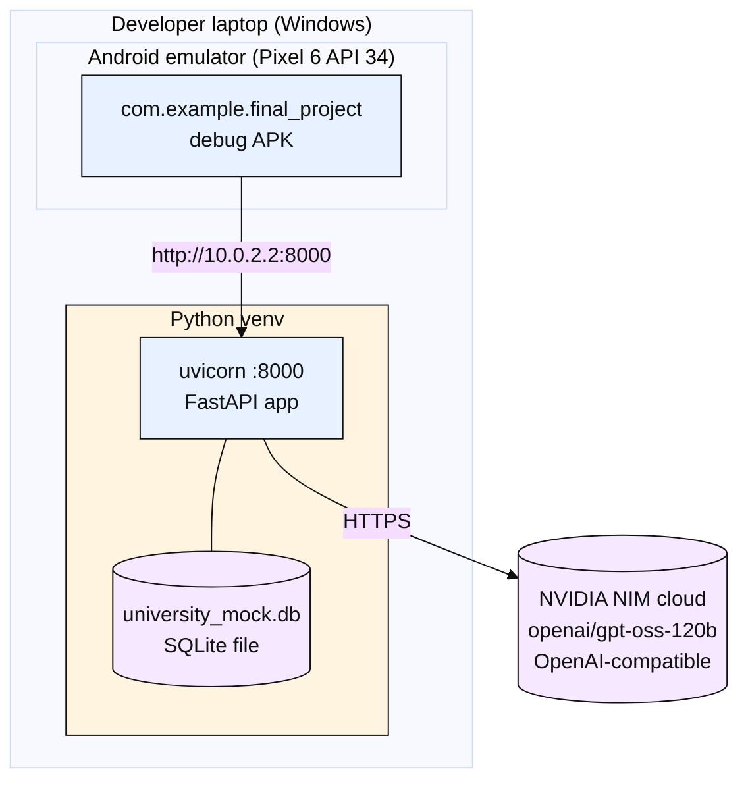

---

## Android navigation

The five Compose screens and how the user moves between them.

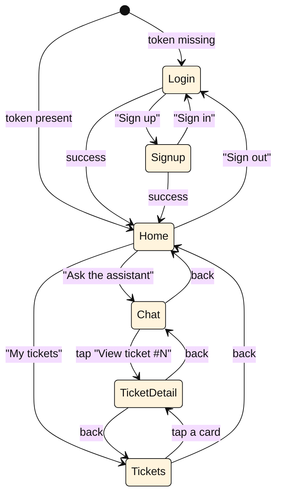

---

## Authentication flow

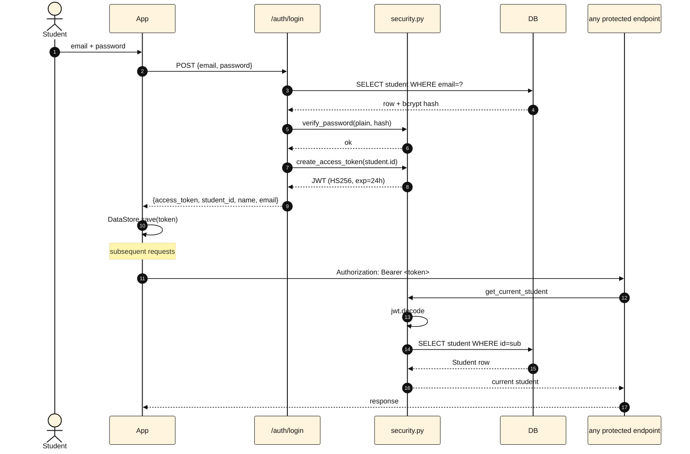

A **tampered or expired token** never reaches the database — `jwt.decode` raises before `get_current_student` resolves a row, and FastAPI returns `401 Unauthorized`.

---

## Tool calling cycle (inside one dept agent)

Zoom in on what happens during a single department agent's React loop. This is **the** moment where the LLM "decides" to read a row from the DB.

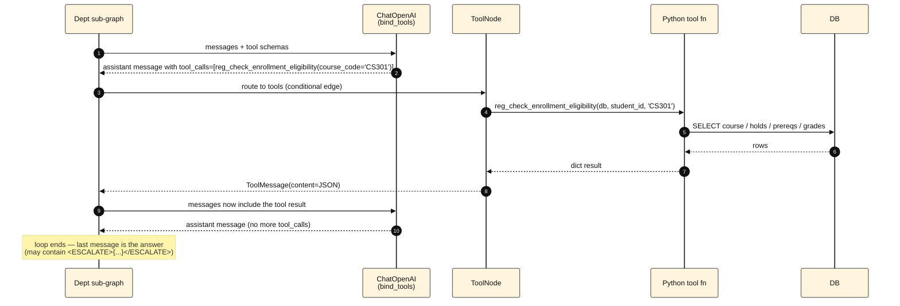

---

_Last updated: post-LangGraph-rewrite, 30/30 functional + 25/25 security + 5/5 UI green._
